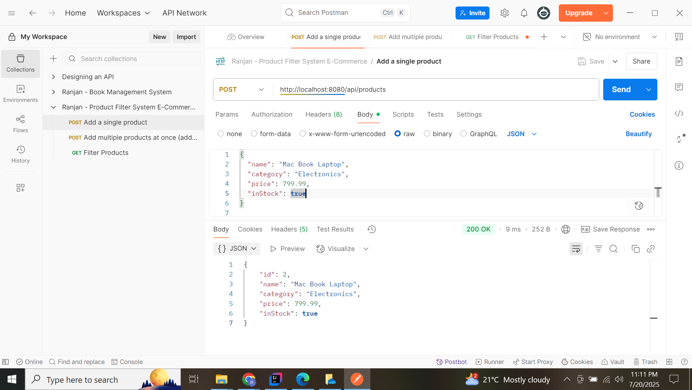
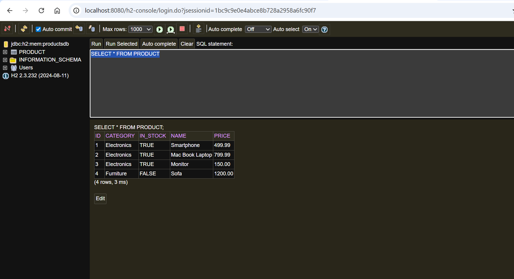

# SpringBoot E-Commerce Application Product Filter Feature

# 📦 Spring Boot Product Filter API

A Spring Boot REST API for managing products with support for:

- ✅ Adding single or multiple products
- 🔍 Filtering products with dynamic query parameters
- 💾 Persisting data using H2 in-memory database
- 🧩 Spring Data JPA with Specification pattern
- ⚙️ Pagination support

---

# Test Evidences:

Postman Call:

Output (Data Stored in H2 DB):

## 🚀 Getting Started

### 🔧 Prerequisites

- Java 17+
- Maven

### ▶️ Run the App

mvn spring-boot:run

## API Endpoints

### Add a Single Product: POST /api/products

### Request Body
<pre>{
  "name": "Mac Book Laptop",
  "category": "Electronics",
  "price": 799.99,
  "inStock": true
} </pre>

### Sample Response

<pre>{
    "id": 2,
    "name": "Mac Book Laptop",
    "category": "Electronics",
    "price": 799.99,
    "inStock": true
} </pre>

### Add Multiple Products: POST /api/products/bulk

### Request Body
<pre>[
  {
    "name": "MacBook Pro",
    "category": "Electronics",
    "price": 2500,
    "inStock": true
  },
  {
    "name": "Office Chair",
    "category": "Furniture",
    "price": 300,
    "inStock": false
  }
] </pre>

### Sample Response: 
<pre>[
  {
    "id": 2,
    "name": "MacBook Pro",
    "category": "Electronics",
    "price": 2500,
    "inStock": true
  },
  {
    "id": 3,
    "name": "Office Chair",
    "category": "Furniture",
    "price": 300,
    "inStock": false
  }
] </pre>

## Filter Products: GET /products

### Query Parameters
- Param: name, category, minPrice, maxPrice, inStock, page, size
- Type: String, String, Double, Double, Boolean, Integer, Integer
- Description: Partial match (case-insensitive), Exact match (case-insensitive), Minimum price, Maximum price, Filter by stock availability, Page number (default: 0), Page size (default: 10)

### Example Request
<pre>http://localhost:8080/api/products?category=Electronics&priceMin=100&inStock=true&page=0&size=5 </pre>

### Sample Response: 
<pre>{
    "content": [
        {
            "id": 1,
            "name": "Smartphone",
            "category": "Electronics",
            "price": 499.99,
            "inStock": true
        },
        {
            "id": 2,
            "name": "Mac Book Laptop",
            "category": "Electronics",
            "price": 799.99,
            "inStock": true
        },
        {
            "id": 3,
            "name": "Monitor",
            "category": "Electronics",
            "price": 150.00,
            "inStock": true
        }
    ],
    "pageable": {
        "pageNumber": 0,
        "pageSize": 5,
        "sort": {
            "empty": false,
            "sorted": true,
            "unsorted": false
        },
        "offset": 0,
        "paged": true,
        "unpaged": false
    },
    "last": true,
    "totalElements": 3,
    "totalPages": 1,
    "size": 5,
    "number": 0,
    "sort": {
        "empty": false,
        "sorted": true,
        "unsorted": false
    },
    "first": true,
    "numberOfElements": 3,
    "empty": false
} </pre>

## H2 Database Console
- Access the H2 database at: http://localhost:8080/h2-console
- Use the following settings:
- JDBC URL: jdbc:h2:mem:productsdb
- User: sa
- Password: (leave blank)

## Tech Stack
- Spring Boot 3.x
- Spring Data JPA
- H2 In-Memory Database
- Spring Web
- Lombok (optional)

## License
This project is licensed under the MIT License.

## You have some query?
If you have some query, feel free to connect with me here -- [Ranjan Kumar Mandal](https://www.linkedin.com/in/ranjan-kumar-m-818367158/)
